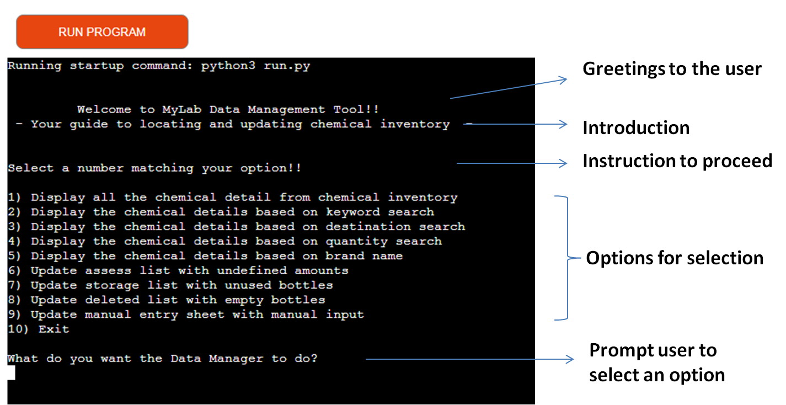
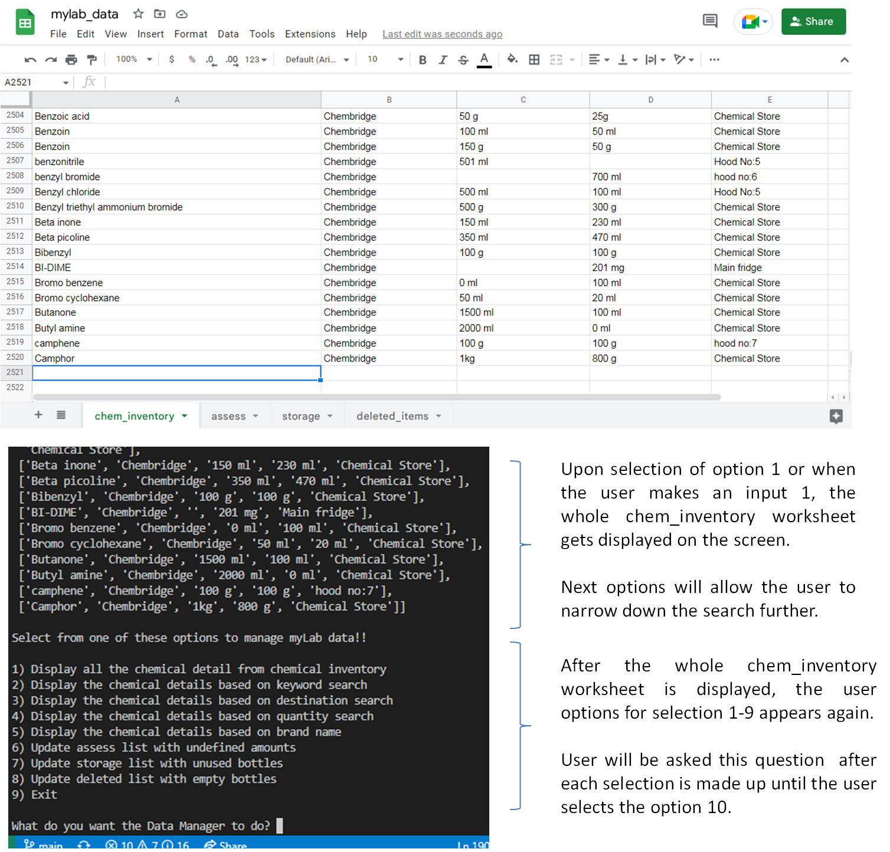
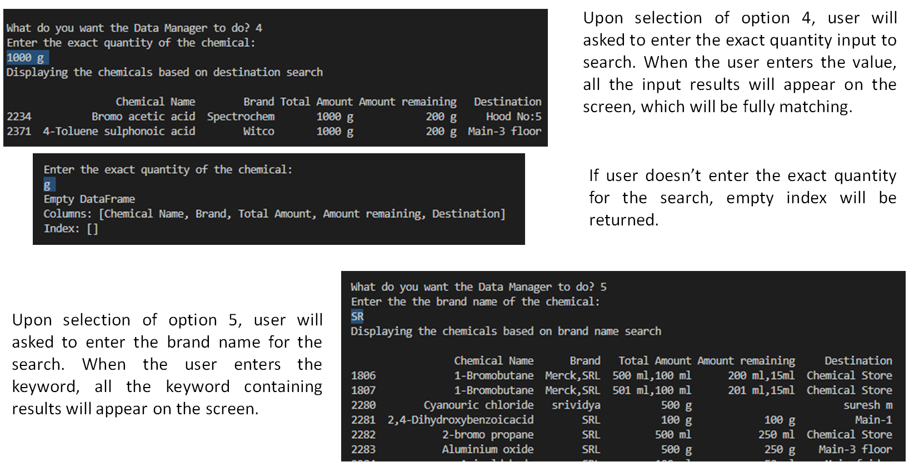
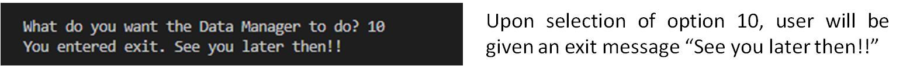
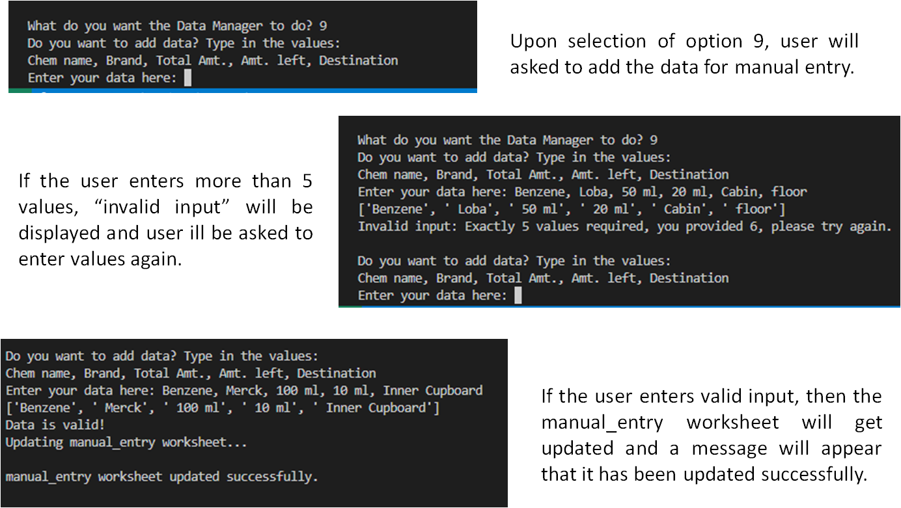

# myLab Data Manager
myLab Data Manager allows the user to sort and organise data, so that the user can easily search and locate chemicals. After locating the items, the user can transfer the chemicals to the different worksheets based on the remaining quantity of the chemicals. 

## CONTENTS
- <a href= "#ux">User Experience UX </a> 
- <a href= "#us"> User Stories </a>
    -  <a href= "#first-time"> First Time Visitor Goals </a>
    -  <a href= "#returning"> Returning Visitor Goals</a>
-  <a href= "#design">Design</a>
    - <a href= "#structure"> Data Manager Structure</a>
    -  <a href= "#flowchart">Flowchart</a>
-  <a href= "#features">Features</a>
    -  <a href= "#insight">Inventory insights</a>
    -  <a href= "#update">Updating Google Sheets</a>
- <a href= "#technologies">Technologies</a>
- <a href= "#languages">Languages Used</a>
- <a href= "#libraries">Libraries Used</a>
- <a href= "#issues">Issues and Fixes</a>
- <a href= "#testing">Testing </a>
- <a href= "#validation">Validation</a>
    -  <a href= "#pep8">PEP8 Online Validator</a>
-  <a href= "#deployment">Deployment</a>
    -  <a href= "#deploy">Project Deployment on GitHub pages</a>
-  <a href= "#credits">Credits</a>
    - <a href= "#content">Content</a>
    - <a href= "#media">Media</a>
-  <a href= "#acknowledgements">Acknowledgements</a>

<h2 id = "ux"> USER EXPERIENCE UX </h2>

- <h3 id = "us"> User Stories </h3>

    - <h3 id = "first-time">  First Time Visitor Goals</h3>
        -  As a student who is looking for ...

    - <h3 id="returning"> Returning Visitor Goals</h3>
        - As a student who is revisiting the ...

<h2 id = "design"> DESIGN </h2>

- <h3 id="struture">  Data Manager Structure </h3>
    The Data Manager Structure consists of..

- <h3 id="flowchart"> Flow chart </h3>

    

<h2 id = "features"> FEATURES </h2>

- <h3 id= "insight"> Inventory insights </h3>

Upon selection of option 1 or when the user makes an input 1, the whole chem_inventory worksheet gets displayed on the screen. Next options will allow the user to narrow down the search further.
After the whole chem_inventory worksheet is displayed, the user options for selection 1-9 appears again. 
User will be asked this question  after each selection is made up until the user selects the option 10.

Upon option 2 selection, user will be asked to make an entry of chemical name they wish to find.
When the user makes an entry, all the input containing results will appear on the screen. Following which, the user will be asked a question, if the search was helpful.  

If the user selects n (no), User will be asked to enters more specific keyword. Upon input, chemical list containing exactly the typed in keyword will appear on the screen. And a message, “Great! You got it now!!’
If the user selects y (yes),  “Awesome!”will be printed.
If no entry, “Please enter y/n!” will be printed.

Upon selection of option 3, user will asked to enter the destination keyword. When the user makes an destination keyword search, all the keyword containing results will appear on the screen. 
Smaller lists will be fully visible and big lists would appear as shown below. To guide the user, a message asks the user to enter slightly more specific keyword.

Upon selection of option 4, user will asked to enter the exact quantity input to search. When the user enters the value, all the input results will appear on the screen, which will be fully matching.
If user doesn’t enter the exact quantity for the search, empty index will be returned.

Upon selection of option 5, user will asked to enter the brand name for the search. When the user enters the keyword, all the keyword containing results will appear on the screen. 

Upon selection of option 10, user will be given an exit message “See you later then!!”

- <h3 id= "update"> Updating Google Sheets </h3>

Retrieved data from chemical inventory list printed at the terminal, which gets appended in the assess worksheet of myLab_data spreadsheet.

Data is retrieved based on the full bottles or matching values of Amount remaining column and Total Amount column. 
Retrieved data from chemical inventory gets appended in the storage worksheet.  

Retrieved data from chemical inventory list printed at the terminal, which gets appended in the deleted_items worksheet of myLab_data spreadsheet.
Data is retrieved based on the empty bottles from the Amount remaining column.
Retrieved data from chemical inventory gets appended in the deleted_items worksheet.

Upon selection of option 9, user will asked to type in the data. The values to be entered will be displayed. Only upon adding 5 values, will the manual_entry table be updated. 
Upon selection of option 9, user will asked to add the data for manual entry. 
If the user enters more than 5 values, “invalid input” will be displayed and user will be asked to enter values again.
If the user enters valid input, then the manual_entry worksheet will get updated and a message will appear that it has been updated successfully.

    
<h2 id="technologies">TECHNOLOGIES</h2>

<h3 id= "languages"> Languages Used</h3>

This tool is created purely using Python.

<h3 id= "libraries"> Libraries Used</h3>

- Git - For version control

- GitHub - To create my repositories, save and store my project files

- pandas 

<h2 id="issues">ISSUES AND FIXES </h2>

- Design Implementation

- Function Implementation

    
<h2 id="testing">TESTING </h2>

- <h3 id= "validation"> Validation</h3>

    - <h3 id= "pep8"> PEP8 Online checker</h3>

<h2 id="deployment">DEPLOYMENT </h2>

<h3 id= "deploy"> Project Deployment on GitHub pages</h3>
GitHub pages were used to deploy the site. The steps to activate Github pages:

- Navigate to the <i>Settings</i> tab in the GitHub repository.
- Navigate to the 'Pages' tab on the left of the page.
- Go to the 'Build and deployment' section, select 'Deploy from a branch' in the <i>source</i> dropdown.
- Select branch 'main' and click on 'Save'.
- Deployment link generated: ...

<h2 id= "credits"> CREDITS </h2>

- <h3 id= "content"> Content</h3>
A few references used for coding:
- Stack overflow 

- <h3 id= "media"> Media</h3>

- Youtube videos were referred to in order to understand and clarify many functions.
     

<h2 id= "acknowledgements"> ACKNOWLEDGEMENTS </h2>
I would like to acknowledge the following people who have helped me along the way in completing my third milestone project:

- My Mentor Jubril Akolade for his guidance, best suggestions and constant encouragement. I very much appreciate his coding tips that helped me solve really complicated challenges I faced.
- My fellow students for their company and encouragement. Kenan, Lane and Paul for guiding us through. Special thanks to Kristyna Maulerova for her encouragement and support.
- My tutors who helped me understand the concepts better.

#### RETURN TO THE [TOP](#ux)

Welcome RoshnaVakkeel,

This is the Code Institute student template for deploying your third portfolio project, the Python command-line project. The last update to this file was: **August 17, 2021**

## Reminders

* Your code must be placed in the `run.py` file
* Your dependencies must be placed in the `requirements.txt` file
* Do not edit any of the other files or your code may not deploy properly

## Creating the Heroku app

When you create the app, you will need to add two buildpacks from the _Settings_ tab. The ordering is as follows:

1. `heroku/python`
2. `heroku/nodejs`

You must then create a _Config Var_ called `PORT`. Set this to `8000`

If you have credentials, such as in the Love Sandwiches project, you must create another _Config Var_ called `CREDS` and paste the JSON into the value field.

Connect your GitHub repository and deploy as normal.

## Constraints

The deployment terminal is set to 80 columns by 24 rows. That means that each line of text needs to be 80 characters or less otherwise it will be wrapped onto a second line.

-----
Happy coding!