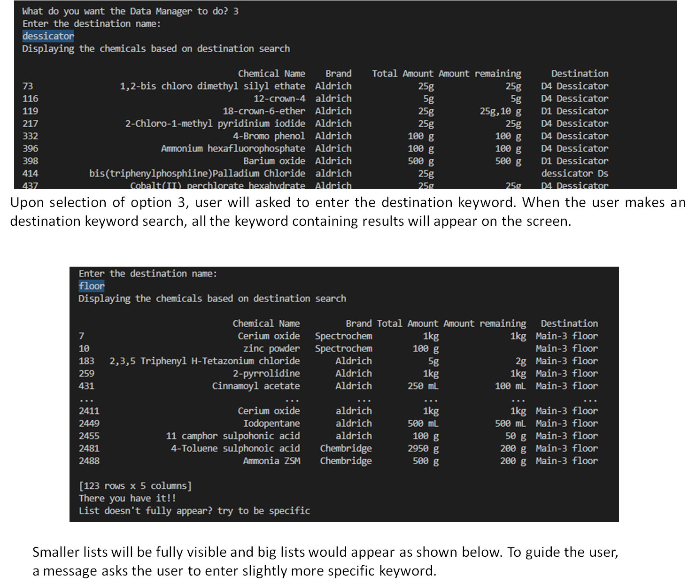
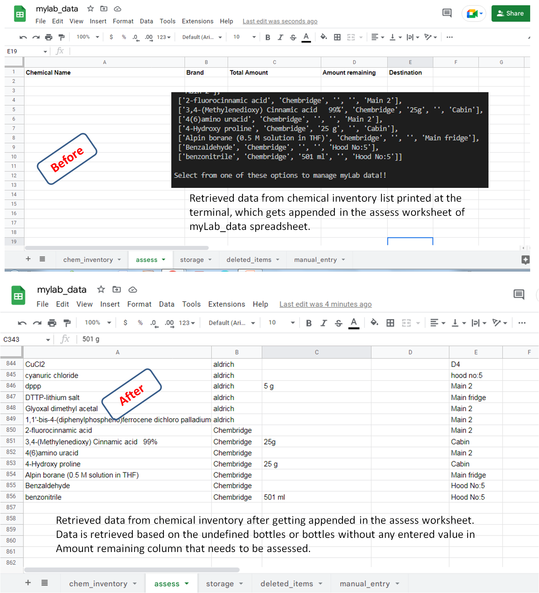

# myLab DATA MANAGER

## PURPOSE
myLab Data Manager allows the user to sort, organise and manipulate data from myLab chemical inventory list. The can easily visualize the information using just a few clicks and inputs. After locating the items, the user can also transfer the chemicals to the different worksheets and manage data by evaluating the remaining quantity of the chemicals. 

## PERSPECTIVE
As a chemist, who has seen chemical inventories evolve over the years. It used to be lab records earlier, then arrived excel sheets saved on computers, then it became connected with internet and shared. Nowadays it has evolved to electronic chemical inventories, where one can visualize entire institutes inventories at one place, allowing the lab inventory organisation using auditing trail for every sample. it means there can be easy exchange of information and very smooth sharing mechanism possible. 
This idea of myLab data manager can be easily extended to make a similar application in combination with excel sheet. Using which one can update the list and organize data without individually going and searching long lists of excel worksheets but just entering a small keyword and the required piece of information would be presented to the user.  

## CONTENTS
- <a href= "#ux">User Experience UX </a> 
- <a href= "#us"> User Stories </a>
    -  <a href= "#user"> User Goals </a>
    - <a href= "#creator"> Creator Goals </a>

-  <a href= "#design">Design</a>
    - <a href= "#structure"> Data Manager Structure</a>
    -  <a href= "#flowchart">Flowchart</a>
-  <a href= "#features">Features</a>
    -  <a href= "#insight">Inventory insights</a>
    -  <a href= "#update">Updating Google Sheets</a>
- <a href= "#technologies">Technologies</a>
- <a href= "#languages">Languages Used</a>
- <a href= "#libraries">Libraries Used</a>
- <a href= "#issues">Issues and Fixes</a>
- <a href= "#testing">Testing</a>
- <a href= "#validation">Validation</a>
    -  <a href= "#pep8">CI Python Linter Test</a>
-  <a href= "#deployment">Deployment</a>
    -  <a href= "#deploy">Project Deployment on Heroku</a>
-  <a href= "#credits">Credits</a>
    - <a href= "#content">Contents</a>
    - <a href= "#media">Media</a>
-  <a href= "#acknowledgements">Acknowledgements</a>

<h2 id = "ux"> USER EXPERIENCE UX </h2>

- <h3 id = "us"> User Stories </h3>

    - <h3 id = "user">User Goals</h3>
        As a user of this application I want:
    1. to be able to see options guiding how to proceed, so that parse the chemical list easily using just selecting options. 
    2. to be able to see the whole list of chemicals and their details enlisted, so that I can make an appropriate idea how many chemicals exist in the main chemical inventory.
    3. to be able to see the whole list of chemicals and their details enlisted, so that I can make an appropriate idea of which brands and destinations can I look for the chemicals.
    4. to be provided options to execute keyword inputs based search, so that I don't have to type in the whole complicated chemical name to locate them.
    4. to be provided exact input based search, so that I don't get a broad search result that needs further time to analyze.
    5. my search be very specific, so that I can get the result directly without enetering too many details.
    5. to be able to locate individual chemical details based on keywords search of the chemical/ brand / destination names, or quantities, so that I don't need to remember every detail of the chemical.
    6. to be able to locate the list of undefined amounts (with missing information) and update them in assess category, so that I can look it up and add details later.
    7. to be able to locate the fully filled bottles and update them in storage category, so that full bottles can be stored and open ones can be used.
    8. to be able to locate the empty bottles and update them deleted_items category, so that I can have a record to know which chemicals are over.
    9. to be able to manually input data and update them manual_entry category, so that I can add the chemicals and their details to record them.
    10. to be able to shown the all the options until I choose to exit, so that I don't need to start the application over and over again.

    - <h3 id = "creator"> Creator Goals</h3>

    As a creator of this application I want:
    1. to offer the user the list of options to choose from, so that they can proceed with just one input. 
    1. to ask user inputs step by step by asking them questions, so that I can find their answers quickly.
    2. to be able to help user locate the chemicals with simple keyword search, so that user doesn't need to enter large chemical names to enable search.
    3. to be able to to help user locate the chemicals with exact search like with chemical names, so that user doesn't need to go through a large list to arrive at the answer.
    4. to enable user to locate chemicals ith incomplete information and update assess worksheet, so thet user can have all results in one place for futher check.
    5. to enable user to locate filled bottles and update storage worksheet, so thet they can have the information of new bottles in one place.
    6. to enable user to locate empty bottles and update deleted_items worksheet, so thet they can have the information of deleted items in one place.
    7. to enable user to manually enter data and update manual_entry worksheet, so thet they can add in data by typing in manually.
    8. to show all the options until user chooses to exit, so that they don't need to start the application all over again.
    9. to give the user a smooth way of parsing and analysing data, so that user doesn't nedd to go to excel sheet and type in names and arrive at single cells but all results in one place.

<h2 id = "design"> DESIGN </h2>

- <h3 id="struture"> Data Manager Structure </h3>

    The myLab Data Manager Structure consists of the first section that will be visible to the user consists of three parts (depicted in the following image): 
    1. Greeting to the user along with an introduction to the application.
    2. Instruction to the user followed by the options for the user to select.
    3. An input area for user's option selection. The user can select a number that matches the option they want to proceed with.

    User will be asked shown the 2nd and 3rd parts prompting user input until the user selects the option 10 (exit).

    

- <h3 id="flowchart"> Flow chart </h3>
The flow chart was created using [Lucidchart](https://www.lucidchart.com/), a web-based diagramming application. The flow charts shown below, shows the design concept of myLab Data Manager application. It shows how upon selecting options, different kinds of lists will appear. Options 1-5 display results within the console.

 

Upon selecting options 6-9, the results will also appear on the console and also the simultaneous updates will be take place in Google Sheets spreadsheet 'myLab_data'.

<h2 id = "features"> FEATURES </h2>
Upon option selection ranging 1-5, user will be asked to make an input for keywords. User can search and locate chemicals using chemical name, brand name, quantity based or destination keyword search. If options 6-9 are selected, the retrieved data will get displayed in the console and simultaneous update of the respective worksheets will also take place. 
Below the full description upon each option selection is described.

- <h3 id= "insight"> Inventory insights </h3>
    
    - Option 1

    Upon selection of option 1 or when the user makes an input 1, the whole chem_inventory worksheet gets displayed on the screen. The google sheet being analysed has 2520 entries and the whole list will be displayed on the screen. Next options will allow the user to narrow down the search further. 

    

    - Option 2

    Upon option 2 selection, user will be asked to make an entry of chemical name they wish to find. When the user makes an entry, all the input containing results will appear on the screen. Following which, the user will be asked a question, if the search was helpful. The result that appears on first input contains many chemicals as the search is not as a result of specific string full match.

    

    If the user selects n (no) and suggest user is not content with the result, User will be asked to enters more specific keyword. Upon even the same input, chemical list containing exactly the typed in keyword will appear on the screen. And a message, “Great! You got it now!!’
    If the user selects y (yes),  “Awesome!”will be printed.
    If no entry, “Please enter y/n!” will be printed.

    

    - Option 3

    Upon selection of option 3, user will asked to enter the keyword from the destination name. When the user makes the keyword search, all the keyword containing results will appear on the screen. This is not based on full match search. 
    Smaller lists will be fully visible and big lists would appear as shown below (i.e.not full data will be displayed). To guide the user, a message asks the user to enter slightly more specific keyword. Upon increasing specificity, the result will become more apt.

    

    - Option 4
    Upon selection of option 4, user will asked to enter the exact quantity input to search. When the user enters the value, all the input results will appear on the screen, which will be fully matching the input made. This is delibeartely made more specific, because numbers are similar and the list is too long.
    If user doesn’t enter the exact quantity for the search, empty index will be returned.

    - Option 5
    Upon selection of option 5, user will asked to enter the brand name for the search. When the user enters the keyword, all the keyword containing results will appear on the screen. 

    

    - Option 10

    Upon selection of option 10, user will be given an exit message “See you later then!!”
    

- <h3 id= "update"> Updating Google Sheets </h3>

    - Option 6

    Upon selection of option 6, the data containing undefined values/ empty cells in the chem_inventory main worksheet will be targeted. The list that is retrieved from chemical inventory list, wwill get printed at the terminal and also gets updated in the assess worksheet of myLab_data spreadsheet simultaneously.
    

    - Option 7

    Upon selection of option 7, the two columns 'Total Amount' and 'Amount remaining' will be searched and when both the cells contain same values, data is retrieved based on the full bottles. And the values will be displayed at the terminal and also will get updated in the 'storage' worksheet.

    

    - Option 8

    Upon selection of option 8, the two column 'Amount remaining' will be searched for 0 g / 0 ml entries depicting empty bottles. Retrieved data from chemical inventory list printed at the terminal and gets updated in the 'deleted_items' worksheet of myLab_data spreadsheet.

    

    - Option 9

    Upon selection of option 9, user will asked to add the data for manual entry. The values to be entered will be displayed. Only upon adding 5 values, will the manual_entry table be updated. 
    If the user enters more than 5 values, “invalid input” will be displayed and user will be asked to enter values again.
    

    If the user enters valid input, then the manual_entry worksheet will get updated and a message will appear that it has been updated successfully.
    

    
<h2 id="technologies">TECHNOLOGIES</h2>

<h3 id= "languages"> Languages Used</h3>

This tool is created purely using Python language.

<h3 id= "libraries"> Libraries Used</h3>

- [Git](https://git-scm.com/) - For version control
    These commands were used for version control during project:
    - git add . - To add files before committing
    - git commit -m "type your message mentioning changes" - To commit changes to the local repository
    - git push - To push all committed changes to the GitHub repository

- [GitHub](https://github.com/) - To create my repositories, save and store my project files.
- [pandas](https://pandas.pydata.org/)- Python Data Analysis Library
pandas is an open source data analysis and manipulation tool, built on top of the Python programming language. It supports Python 3.8, 3.9 and 3.10 officially. My codes are largely based on pandas code, as they contain extensive functions very well suited for parsing and analysing data.
- [gspread](https://docs.gspread.org/) is a Python API for Google Sheets and requires Python 3+. It allows user to open, read, write, share spreadsheets. Additionally it enables user to select, create, delete worksheets and to format cell ranges.
- [pprint](https://docs.python.org/3/library/pprint.html) — Data pretty printer — Python 2.7, 3.5 onwards.
The pprint module provides “pretty-print” to Python data structures. The formatted representation arranges objects on a single line if it can, and breaks them onto multiple lines if they don’t fit within the allowed width. I used it in order to visualize the lists in more user friendly style.

<h2 id="issues">ISSUES AND FIXES </h2>

- Issue

    1. One of the major issues I faced was my attempt to enable manual data entry to assess list. In my early design strategy, I wanted that user can also type in input of the chemicals and details and add it to the retrieved list within the function - update_assess_worksheet(). But I couldn't achieve it because of the two lists being different in their types. As my method of retriving the data uses pandas library, the list is  extracted as dataframes.  
    However, the manual data entry a user makes is actually comma separated values and string value needs to be converted into a list of values. Using the split() method, we break up commas and convert into list. 
    The dataframes and the list do not add up well. The manual data (which now appends in a new list named manula_entry) appends to the list but it appears to append from coumn E not column A, as shown in figure below.
    

    I tried various methods to align the lists by coverting the manual entry list to dataframes, but they weren't fruitful. Finally I decided to make a manual_entry worksheet where the entries can be appended in a new list.

    2. I faced a problem with an input in display_chem_keyword_search() function. When I needed two inputs in the question for the user:

    print('\nDid the search help you?[y/n]\n')
    i = input()
    if i == 'n':
        i = input('\nTry more specific keyword: \n')
        if i not in df:
            print('\nDisplaying chemicals and details:\n')

    This caused the function to work, but the input needed to be entered 3 or 4 times. For eg. n n n and then the print statement 'Displaying chemicals and details:' would appear.

    This was solved with my mentor's help and I learnt this that one must enter 
    i = input('\nDid the search help you?[y/n]\n') 
    
    rather than using

    print('\nDid the search help you?[y/n]\n')
    i = input()

    and the problem got solved. 
    
<h2 id="testing">TESTING </h2>

- <h3 id= "pep8"> Python Linter Test</h3>
As advised by tutors that pep8 no longer working, I validated Code Institute Python linter.  Test result: No errors found. It showed no warnings or problems as in screenshot below. 
   

<h2 id="deployment">DEPLOYMENT </h2>

<h3 id= "deploy"> Project Deployment on Heroku</h3>

myLab Data Manager application was deployed using [Heroku](https://heroku.com/) - a platform as a service (PaaS) that enables developers to build, run, and operate applications fully in the cloud. The folloing steps were followed for deployment.

1. Visit [Heroku.com](https://www.heroku.com/) and create a new account.
2. Click the 'New' button on the top right corner, and select 'Create new app' from the dropdown menu,
3. Create a name for your app using available App names in lower-case letters, numbers and dashes. This app was named "mylab-data-manager"
4. Select region, in this case, 'Europe'.
5. Click on the 'Create App' button.  
6. The app gets created in Heroku and Heroku dashboard gets opened.
7. Before any action, settings must be defined. Navigate to the settings tab and scroll down to the button 'Reveal Config vars'.
8. For the 'KEY', enter 'CREDS' in the input area and then for word 'VALUE', copy and paste the whole data from 'creds.json' file then click on the 'Add' button.
9. Scroll down to 'Buildpacks'. Click the 'Add Buildpack' button.
10. From the pop up window, select 'python' and save changes.
11. Repeat this again but this time selecting 'node.js' and save the changes.
    It is 'important' to make sure the buildpacks are in the correct order with 'Python' first and 'node.js' second. If they are not in the correct order, drag them into the right order.
12. After the settings are done, navigate to the 'Deploy' tab at the top left side.
13. Select the option 'Github, 'connect to github' as the deployment method.
14. Search for the Github Repository in the search field (in this case 'myData_Data_Manager') and start 'Search'.
15. When the search is complete the link to github repository will appear, click 'connect'.
16. Once the repository is connected to Heroku, Click the 'Enable Automatic Deploys' button for automatic deployment.
17. Alternatively one can manually deploy by selecting a branch to deploy from and clicking 'Deploy Branch'.
18. If 'Enable Automatic Deploys' is chosen, Heroku will build a new version of the app when a change to 
    'gitpod' is pushed to 'Github'.  
19. Manual deployment allows the update the app whenever 'Deploy Branch' is clicked.
20. In case of this project, I selected 'Enable Automatic Deploys' to ensure the code was deployed straight away at each push from 'Gitpod'.
21. Once the build process completes (this can take a few seconds), live app could be viewed by clicking button 'View' below 'Your app was successfully deployed'.
22. Link generated: https://mylab-data-manager.herokuapp.com/

<h2 id= "credits"> CREDITS </h2>

<h3 id= "content"> Contents</h3>

- A few references other than https://learn.codeinstitute.net/ci_program/diplomainfullstacksoftwarecommoncurriculum used for coding:
- Stack overflow
- https://www.geeksforgeeks.org/
- https://www.w3schools.com/ 
- To set up while loop user selection: http://introtopython.org/while_input.html
- For installation of panda library: https://www.codegrepper.com/code-examples/shell/pandas+pip+install
- Function to set keyword search using display_chem_keyword_search(): https://www.geeksforgeeks.org/select-rows-that-contain-specific-text-using-pandas/
- pandas.Series.str.contains to search using keyword:
https://pandas.pydata.org/pandas-docs/version/0.23/generated/pandas.Series.str.contains.html
- Function to check empty cells in a row: https://stackoverflow.com/questions/66888339/find-empty-cells-in-rows-of-a-column-dataframe-pandas
- Append values to worksheet using pandas: 
https://medium.com/@jb.ranchana/write-and-append-dataframes-to-google-sheets-in-python-f62479460cf0
- To concatante dataframes: https://pandas.pydata.org/docs/user_guide/merging.html
- To update dataframes in worksheet: https://docs.gspread.org/en/latest/user-guide.html
- To update storage worksheet, two columns containing same value in a row: https://stackoverflow.com/questions/56198775/find-rows-having-same-values-in-multiple-columnsnot-all-columns-in-pandas-data

- <h3 id= "media"> Media</h3>

- Youtube videos were referred to in order to understand and clarify many operations.

<h2 id= "acknowledgements"> ACKNOWLEDGEMENTS </h2>
I would like to acknowledge the following people who have helped me along the way in completing my third milestone project:

- My Mentor Jubril Akolade for his guidance, best suggestions and constant encouragement. I very much appreciate his coding tips that helped me solve really complicated challenges I faced.
- My fellow students for their company and encouragement. Kenan, Lane and Paul for guiding us through. Special thanks to Kristyna for her encouragement and support.
- My tutors who helped me understand the concepts better.

#### RETURN TO THE [TOP](#ux)